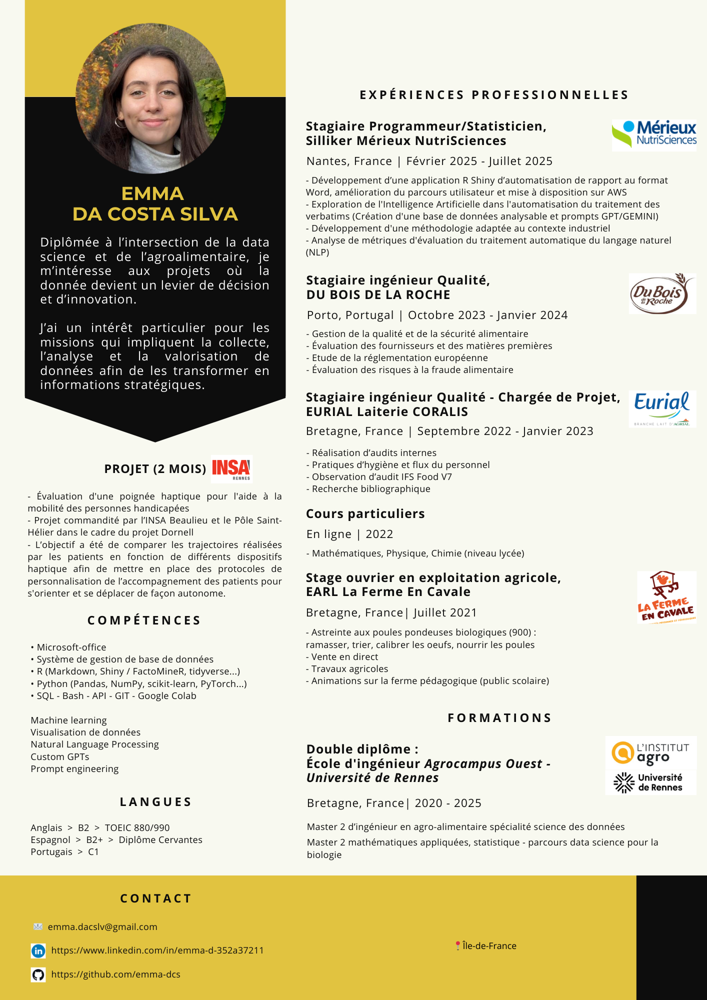
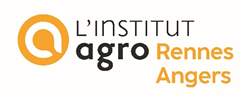
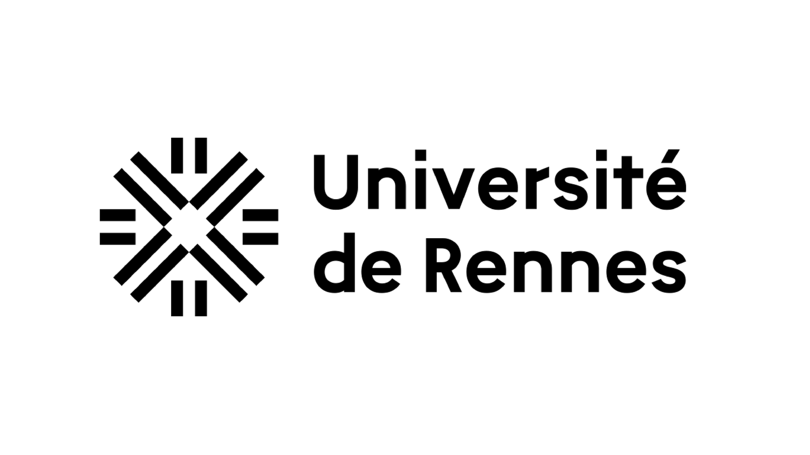

Double diplomée

| Ingénieure Agroalimentaire Spécialité Science des données Institut Agro Rennes | Master 2 Mathématiques appliquées, statistique Parcours Data Science Université de Rennes |
| :--: | :--: |
|  |  |

Je propose des missions en freelance centrées sur l'analyse de données, le prototypage d'applications interactives, la création de graphiques de visualisation des donnéese et l'intégration de l'Intelligence Artificielle pour l'analyse de données textuelles.
