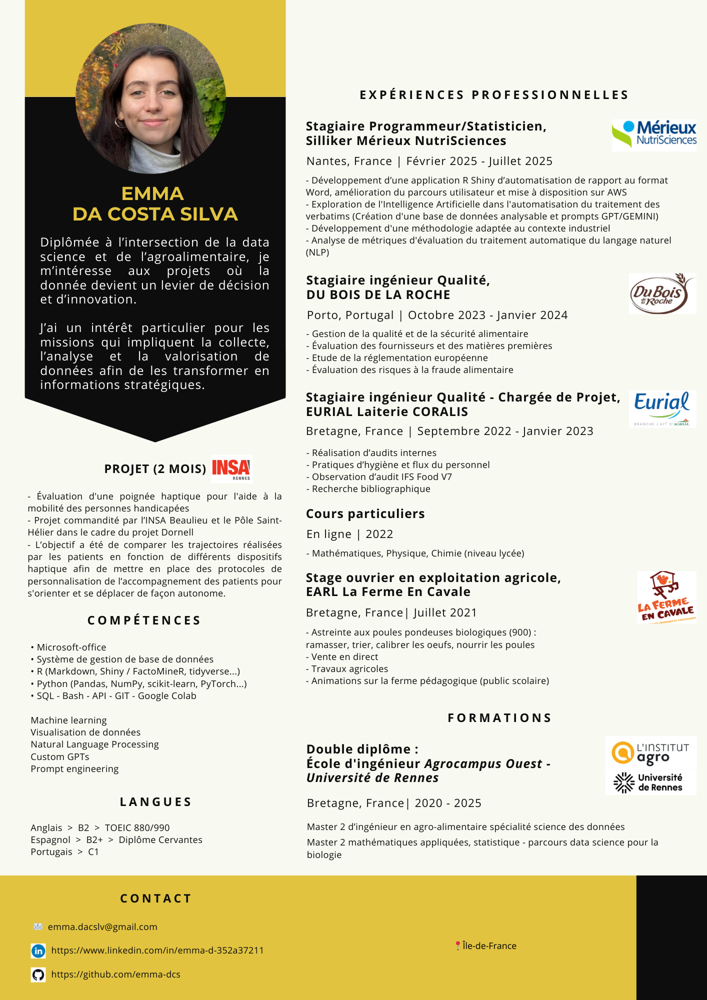

<h2 style="text-align: center;">Hard skills</h2>

### **- Langages et Outils:**
● R : Shiny, Markdown, tidyverse, caret, FactoMineR  
● Python : pandas, scikit-learn, transformers, NumPy, spaCy, PyTorch, TensorFlow  
● SQL : écriture de requêtes, optimisation de requêtes, gestion de bases relationnelles  
● Autres outils : Git, Google Colab, Jupyter Notebook  

### **- NLP / LLM :**
● Prétraitement de textes : tokenization, nettoyage, lemmatisation, stopwords  
● Embeddings : Word2Vec, BERT, OpenAI  
● Clustering sémantique et classification thématique  
● Prompts engineering  
● Déploiement d'API et intégration dans des applications  

### **- Data Science / Machine Learning :**
● Préparation et nettoyage de données  
● Modèles supervisés : régression, classification, arbres de décision, forêts aléatoires  
● Modèles non supervisés : clustering, PCA  
● Validation croisée, optimisation d'hyperparamètres, métriques de performances  

### **- Data Visualisation :**
● R : ggplot2, Shiny dashboards interactifs  
● Python : matplotlib, seaborn, plotly  
● Conception de dashboards et reporting automatisés (Power BI, Tableau, R Shiny, Dash)  

### **- Bases de données et Gestion des données :**
● Conception de questionnaires et systèmes de collecte de données  
● Gestion et modélisation de bases relationnelles : MySQL, PostgreSQL, Access  
● Bonnes pratiques en structuration et documentation des données  

  
  
  
<h2 style="text-align: center;">Soft skills</h2>
● Gestion de projet agile : planification, priorisation, suivi d'avancement  
● Collaboration interdisciplinaire : travail en équipe avec data engineers, développeurs, métiers, UX/UI designers  
● Recueil et analyse des besoins utilisateurs : compréhension métier, traduction en solutions data  
● Communication des résultats : vulgarisation des analyses, storytelling, présentation aux parties prenantes non techniques  
● Esprit critique et résolution de problèmes : capacité à formuler des hypothèses, tester et proposer des solutions data-driven  
● Autonomie et curiosité : veille technologique/bibliographique, apprentissage continu, expérimentation de nouveaux outils  
  

  

---
  
  

# Mon CV <a href="assets/images/CV_Emma_ing_data.png" download="CV_Emma_ING_DATA.png" class="btn-telecharger">
  📄 Télécharger le CV
</a>

